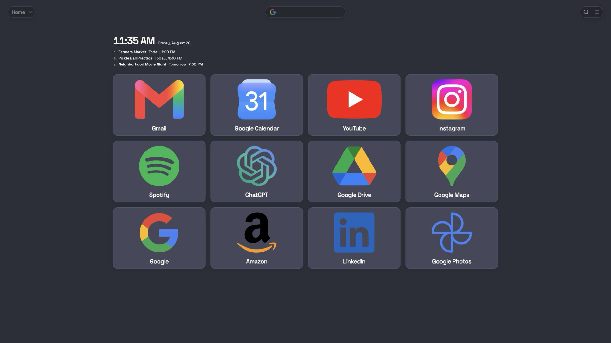

# Dracula for [SpeedGrid](https://speedgrid.app)

> Dracula Classic and Alucard Classic for a visual new-tab workspace.

SpeedGrid is available for Chrome, Edge, and Firefox. Both Dracula Classic and Alucard Classic are built into the product as community themes using the current official specification.

## Install

All instructions are available in [INSTALL.md](INSTALL.md). A public overview is available at [speedgrid.app/showcase/dracula](https://speedgrid.app/showcase/dracula).

## Palette mapping

| Dracula role | SpeedGrid surface |
| --- | --- |
| Background | Page background |
| Selection | Bookmark cards and controls |
| Foreground | Primary interface and bookmark titles |
| Current Line | Restrained card borders |
| Purple and Cyan | Interactive accents |

The exact values used for both variants are documented in [`themes.json`](themes.json).

## Status

This is an independent implementation submitted for Dracula Theme community review. It is not currently accepted, endorsed, or maintained by the Dracula organization.

## Team

This theme is maintained by [Joey Wright](https://github.com/joeywrightphoto).

## Community

- [Dracula Theme](https://draculatheme.com)
- [Dracula Theme discussions](https://github.com/dracula/dracula-theme/discussions)

## License

[MIT License](./LICENSE)
